# CLIENTE-SERVIDOR
Examen 
# Cree un repositorio
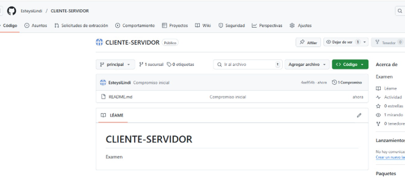
# Cree una rama para mi examen 
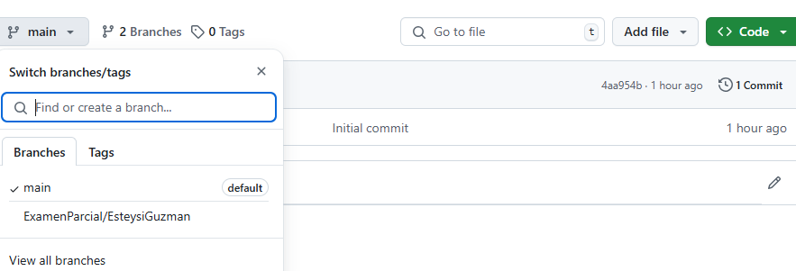
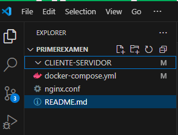

# levante servicios de postgressql , mongoDB y nginx 
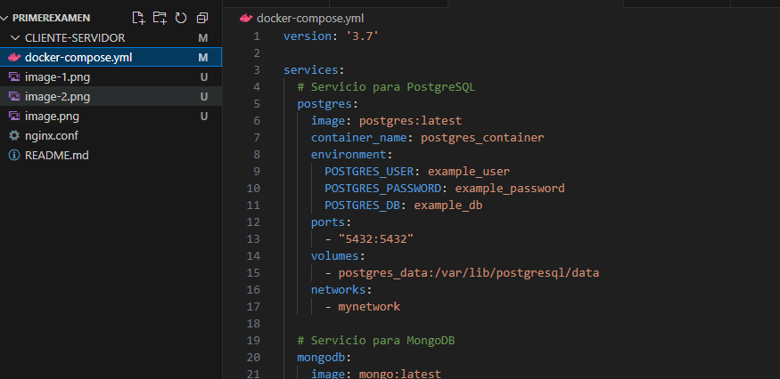
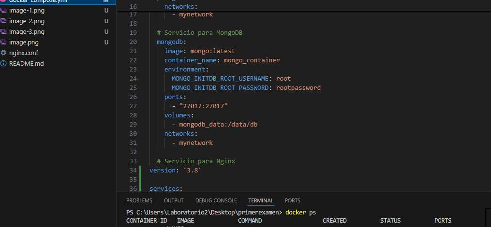
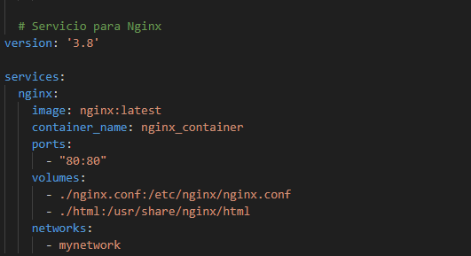
# ya levante con docker ps 
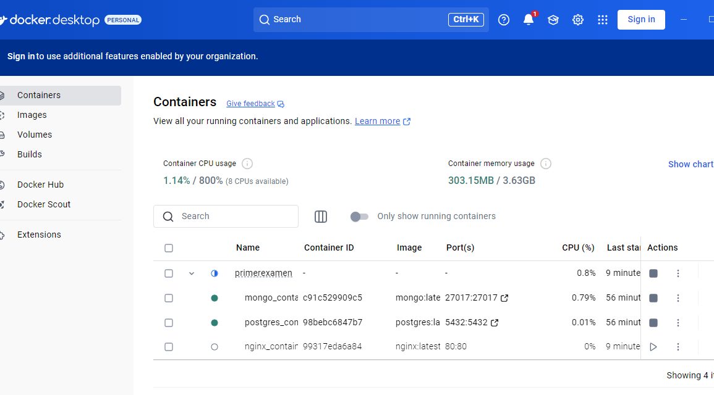
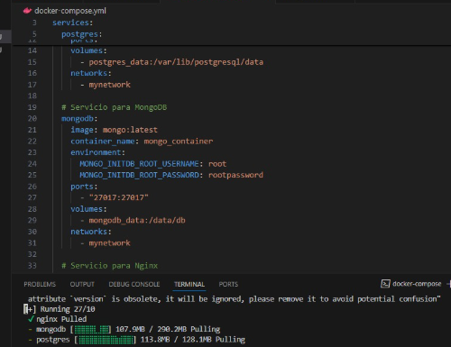

# ejamplo de la tabla en  postgreSql y tambien instale 
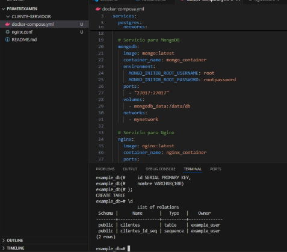
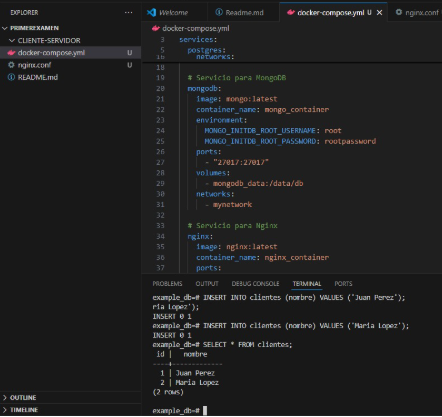

# ejemplo de la coleccion de mongo 
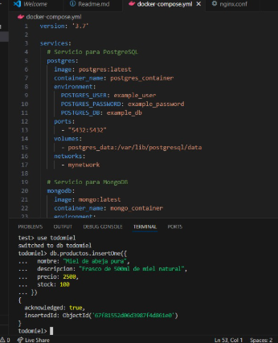
